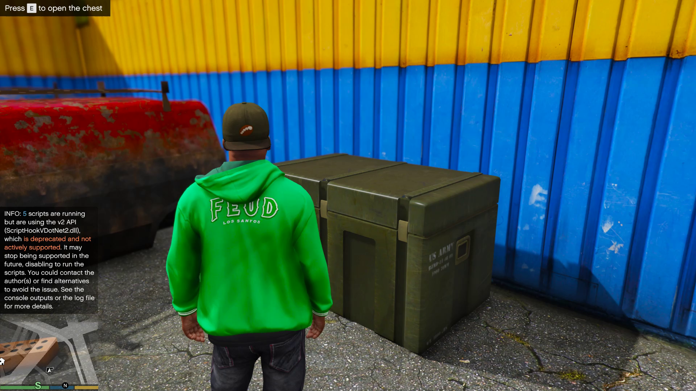
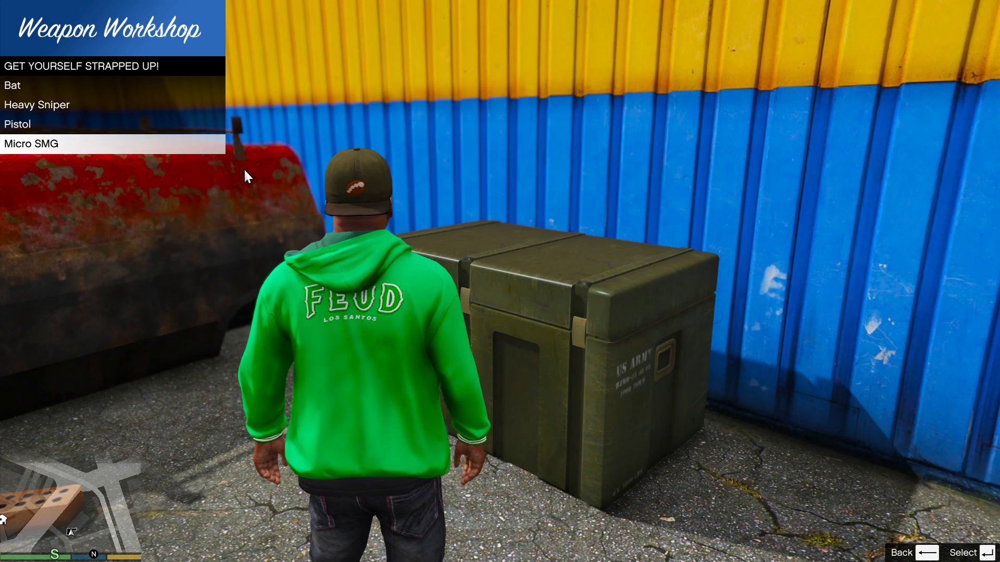
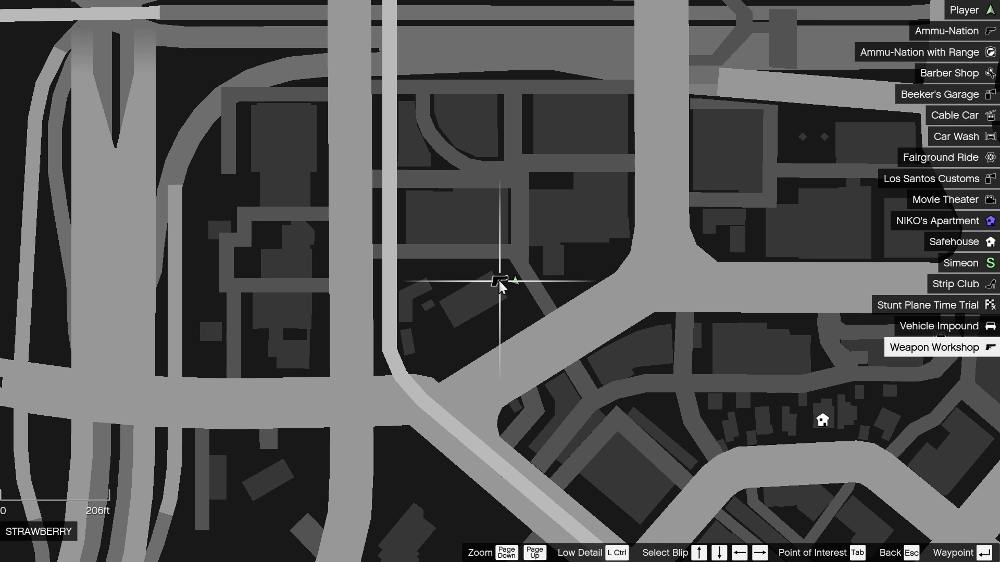

# Weapon Workshop GTA 5

## Overview

Source code of my lore-friendly GTA V mod that spawns a weapon chest in a salvage yard in southern Los Santos.
The weapon selection is randomized. Selecting already possessed weapons will give ammo (amount can be changed in config file).
The chest is also automatically resupplied at a default interval of 15 minutes (can be changed in config file). It also has a dynamic blip on the map.
This is good for role-playing, realism, gangster life etc.

## Preview

